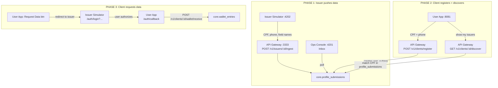

# Issuer Simulator + Client Wallet -- Investor Demo

## Context

The MVP needs a compelling end-to-end demo for investors showing:

1. How issuers (emissores) push client data to the Ultima Forma platform
2. How clients register and discover which issuers already hold their data
3. How clients request their actual data from issuers via a consent-like redirect flow
4. How the data ends up exclusively in the client's personal wallet

---

## Architecture




---

## PHASE 1: Issuer Data Ingestion (existing plan)

### 1. New DB table: `core.profile_submissions`

Stores raw data pushed by issuers. Added to [schema.ts](libs/infrastructure/drizzle/src/lib/schema.ts).

```
core.profile_submissions
  id            uuid PK
  issuer_id     uuid FK -> issuers.id
  tenant_id     uuid FK -> tenants.id
  cpf           varchar(14) NOT NULL
  phone         varchar(20) NOT NULL
  extra_fields  jsonb (array of field names, e.g. ["email","address"])
  status        varchar(50) default 'received'
  created_at    timestamp
```

### 2. Backend: Ingest endpoint on api-gateway

- **New controller:** `apps/api-gateway/src/app/v1/ingest.controller.ts`
  - `POST /v1/issuers/:issuerId/ingest` -- receives `{ cpf, phone, extraFields[] }`
  - No HMAC guard (demo-mode)
  - Persists to `core.profile_submissions`, creates `audit_event`
  - Returns `{ id, status: 'received', createdAt }`
- **Wire into** [v1.module.ts](apps/api-gateway/src/app/v1/v1.module.ts)

### 3. Backend: Internal query endpoint on orchestration-api

- `GET /internal/profile-submissions?limit=&offset=&since=`
- Returns submissions sorted by `created_at DESC` with issuer name

### 4. New app: `apps/issuer-simulator` (:4202)

React + Vite app (same stack as partner-portal). Two tabs -- "Emissor A" / "Emissor B".

Each tab:

- Header with `Partner ID` badge
- CPF input (required, masked `000.000.000-00`)
- Celular input (required, masked `(00) 00000-0000`)
- Dynamic fields: field-name-only inputs + "Adicionar campo" button
- "Enviar para Ultima Forma" submit button
- Response log below showing sent submissions

**Also includes a fake login page** (see Phase 3 below).

### 5. Ops Console: Inbox page

New `/inbox` route polling every 3s. Pulse animation + "NEW" badge on arrivals. Cards show issuer name, masked CPF, phone, field names, timestamp.

### 6. Seed data: 2 issuers

- **Partner A:** "Banco Digital Alpha" -> **Issuer A:** "Alpha Credenciais"
- **Partner B:** "Fintech Beta" -> **Issuer B:** "Beta Verificacao"

Update [fixtures.ts](scripts/fixtures.ts) and [seed.ts](scripts/seed.ts).

---

## PHASE 2: Client Registration + Discovery

### 7. New DB table: `core.wallet_entries`

Stores data values that the client has received into their wallet. This data only lives here -- it represents the client's personal vault.

```
core.wallet_entries
  id                uuid PK
  user_subject_id   uuid FK -> user_subjects.id
  issuer_id         uuid FK -> issuers.id
  field_name        varchar(255) NOT NULL
  field_value       text (nullable -- populated after data request)
  received_at       timestamp (nullable -- null until data arrives)
  created_at        timestamp
```

### 8. Backend: Client endpoints on api-gateway

Four new endpoints (no HMAC guard, demo-mode):

**a) `POST /v1/clients/register`**

- Body: `{ cpf, phone }`
- Creates a `user_subject` (using `externalSubjectRef = cpf`)
- Returns `{ id, cpf, phone, createdAt }`

**b) `GET /v1/clients/:id/discover`**

- Searches `core.profile_submissions` matching the client's CPF
- Groups results by issuer, returns:

```json
{
  "issuers": [
    {
      "issuerId": "...",
      "issuerName": "Alpha Credenciais",
      "partnerName": "Banco Digital Alpha",
      "fields": ["cpf", "phone", "email"],
      "lastUpdated": "2026-03-22T10:00:00Z"
    }
  ]
}
```

**c) `POST /v1/clients/:id/request-data/:issuerId`**

- Generates a `requestToken` (random UUID, stored temporarily)
- Returns a redirect URL to the issuer-simulator's fake login:
`{ redirectUrl: "http://localhost:4202/auth/login?requestToken=...&callbackUrl=...&issuerId=..." }`

**d) `POST /v1/clients/:id/wallet/receive`**

- Body: `{ requestToken, fields: [{ name: "cpf", value: "123.456.789-00" }, ...] }`
- Validates the `requestToken`
- Writes each field to `core.wallet_entries` with `received_at = now()`
- Returns `{ success: true, fieldsReceived: 3 }`

### 9. User App: Registration screen

New screen at `src/app/register.tsx` in [user-app](apps/user-app/).

- CPF input (required, masked)
- Phone input (required, masked)
- "Cadastrar" button -> calls `POST /v1/clients/register`
- On success, navigates to wallet

Update `_layout.tsx` to add the new routes. The home screen (`index.tsx`) becomes a landing that directs to register or wallet.

### 10. User App: Wallet screens

**a) Wallet home** at `src/app/wallet/index.tsx`

- Calls `GET /v1/clients/:id/discover` on mount
- Shows a list of issuers, each as a `NativeCard`:
  - Issuer name + partner name
  - Number of fields available
  - Last updated date
  - Tap to navigate to detail

**b) Issuer detail** at `src/app/wallet/[issuerId].tsx`

- Shows the issuer name at top
- List of fields:
  - Field name (e.g. "cpf", "email")
  - If value exists in wallet: shows the value + "received at" timestamp
  - If value not yet received: shows a lock icon + grayed out
- **"Solicitar Dados" button** at the bottom
  - Calls `POST /v1/clients/:id/request-data/:issuerId`
  - Opens the returned `redirectUrl` (Linking.openURL on native, window.location on web)

---

## PHASE 3: Data Request via Fake OAuth Login

### 11. Issuer Simulator: Fake login page

New route in the issuer-simulator app: `/auth/login`

Query params: `requestToken`, `callbackUrl`, `issuerId`

**UI:**

- Shows the issuer branding (name + partner name)
- Fake username + password fields (pre-filled for demo convenience)
- "Autorizar e Compartilhar Dados" button
- On click:
  1. Fetches the profile_submission data for this issuer + the client's CPF
  2. POSTs the field values to the gateway: `POST /v1/clients/:userId/wallet/receive` with the `requestToken` and actual field values
  3. Redirects to `callbackUrl` (user-app's callback route) with `?success=true`

### 12. User App: OAuth callback screen

New screen at `src/app/auth/callback.tsx`

- Receives `?success=true` or `?success=false`
- Shows a success animation ("Dados recebidos com sucesso!")
- Auto-navigates back to the wallet after 2 seconds
- The wallet detail screen now shows the actual values with green checkmarks

---

## Scripts and Configuration

- Add `dev:issuer-simulator` script to `package.json`
- Add `VITE_GATEWAY_URL=http://localhost:3333` to `.env.example` **and** to `.env`
- Add `EXPO_PUBLIC_API_URL=http://localhost:3333` to `.env` if not present
- Add Nx project configuration for issuer-simulator

---

## Complete Demo Flow (for investors)

**Act 1 -- Issuer pushes data:**

1. Open **Issuer Simulator** (`:4202`), select "Emissor A" tab
2. Enter CPF `123.456.789-00`, phone `(11) 99999-0000`, add field "email", click "Enviar"
3. Switch to "Emissor B" tab, enter **same CPF**, phone, add field "endereco", click "Enviar"
4. Open **Ops Console** (`:4201`) Inbox -- both submissions appear with pulse animation

**Act 2 -- Client registers and discovers:**
5. Open **User App** (`:8081`), register with CPF `123.456.789-00` + phone
6. Wallet shows: "Encontramos seus dados em 2 instituicoes"
7. Tap "Alpha Credenciais" -- sees fields: cpf, phone, email (all locked, no values)
8. Tap "Beta Verificacao" -- sees fields: cpf, phone, endereco (all locked)

**Act 3 -- Client requests data:**
9. On "Alpha Credenciais" detail, tap "Solicitar Dados"
10. Redirected to **Issuer Simulator** fake login page (branded as Alpha)
11. Click "Autorizar e Compartilhar Dados"
12. Redirected back to **User App** -- success animation
13. Wallet now shows Alpha's fields with actual values and green checkmarks
14. Repeat for Beta to complete the demo