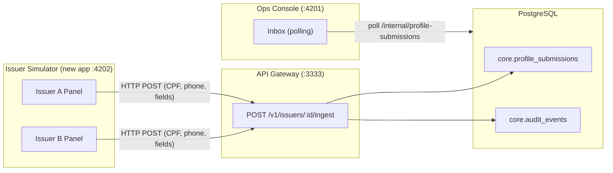

# Issuer Simulator for Investor Demo

## Context

The MVP needs a compelling demo flow showing how issuers (emissores) push client data to the Ultima Forma platform. Today there is no UI to simulate this flow -- the existing `IssuersController` only handles issuer registration/update, not client profile data ingestion.

## Architecture




## What Will Be Built

### 1. New DB table: `core.profile_submissions`

Stores raw data pushed by issuers. A new Drizzle migration and schema entry.

- **File:** [libs/infrastructure/drizzle/src/lib/schema.ts](libs/infrastructure/drizzle/src/lib/schema.ts) (add table)
- **New migration file** via `pnpm db:generate`

```
core.profile_submissions
  id            uuid PK
  issuer_id     uuid FK -> issuers.id
  tenant_id     uuid FK -> tenants.id
  cpf           varchar(14) NOT NULL
  phone         varchar(20) NOT NULL
  extra_fields  jsonb (array of field names, e.g. ["email","address"])
  status        varchar(50) default 'received'
  created_at    timestamp
```

### 2. Backend: Ingest endpoint on api-gateway

A new controller + use case that receives profile data from issuers and persists it.

- **New controller:** `apps/api-gateway/src/app/v1/ingest.controller.ts`
  - `POST /v1/issuers/:issuerId/ingest` -- receives `{ cpf, phone, extraFields[] }`
  - No HMAC auth guard (demo-mode, skipped for simulator simplicity)
  - Persists to `core.profile_submissions`
  - Creates an `audit_event` with `eventType: 'profile_data_received'`
  - Returns `{ id, status: 'received', createdAt }`
- **New repository method** in [libs/infrastructure/drizzle/src/lib/partner.repository.ts](libs/infrastructure/drizzle/src/lib/partner.repository.ts) or a new `IngestRepository`
- **Wire into** [apps/api-gateway/src/app/v1/v1.module.ts](apps/api-gateway/src/app/v1/v1.module.ts)

### 3. Backend: Internal query endpoint on orchestration-api

For the ops-console to list and poll new submissions.

- **New endpoint:** `GET /internal/profile-submissions?limit=&offset=&since=`
  - Returns submissions sorted by `created_at DESC` with issuer name
  - Supports `since` parameter for polling only new items
- **File:** `apps/orchestration-api/src/app/internal/` (new controller or extend existing)

### 4. New app: `apps/issuer-simulator`

A standalone React + Vite app (same stack as partner-portal/ops-console: React 19, Vite 7, Radix UI, Tailwind v4, shared-ui). Runs on port 4202.

**Layout:**

- Two tabs at the top: "Emissor A" and "Emissor B" (one for each seeded issuer)
- Each tab shows:
  - Header with `Partner ID` badge and `Issuer ID`
  - Form with:
    - CPF input (required, with mask `000.000.000-00`)
    - Celular input (required, with mask `(00) 00000-0000`)
    - Dynamic fields section: list of field-name-only inputs + "Adicionar campo" button
    - "Enviar para Ultima Forma" submit button
  - Below the form: a response log showing sent submissions with timestamps and status

**Key files to create:**

- `apps/issuer-simulator/` -- scaffolded via Nx or manually (Vite + React)
- `apps/issuer-simulator/src/app/app.tsx` -- main layout with tabs
- `apps/issuer-simulator/src/app/components/issuer-panel.tsx` -- reusable panel per issuer
- `apps/issuer-simulator/src/app/components/dynamic-fields.tsx` -- add/remove field names
- `apps/issuer-simulator/src/app/lib/api.ts` -- fetch wrapper to POST to gateway

### 5. Ops Console: "Inbox" page enhancement

Add a new `/inbox` route to the ops-console that polls for `profile_submissions` every 3 seconds.

- **New component:** `apps/ops-console/src/app/components/inbox.tsx`
- **Visual treatment:** New items appear with a pulse/highlight animation and a "NEW" badge. A counter in the sidebar shows unread count.
- **Each card shows:** issuer name, CPF (masked), phone, extra field names, timestamp, status
- **Add sidebar link** in [apps/ops-console/src/app/app.tsx](apps/ops-console/src/app/app.tsx)

### 6. Seed data: 2 issuers with distinct partners

Update [scripts/seed.ts](scripts/seed.ts) and [scripts/fixtures.ts](scripts/fixtures.ts) to create:

- **Partner A:** "Banco Digital Alpha" with **Issuer A:** "Alpha Credenciais"
- **Partner B:** "Fintech Beta" with **Issuer B:** "Beta Verificacao"
- Each gets its own `partner_id` (shown in the simulator UI)

Existing demo partner/issuer remain untouched.

### 7. Scripts and configuration

- Add `dev:issuer-simulator` script to `package.json`
- Add `VITE_GATEWAY_URL=http://localhost:3333` to `.env.example` **and** to `.env`
- Add Nx project configuration for the new app

## Demo Flow (for investors)

1. Open **Issuer Simulator** (`:4202`) -- shows two issuer panels side by side
2. Open **Ops Console** (`:4201`) Inbox -- empty, waiting for data
3. In the simulator, fill in CPF + phone for Issuer A, add a dynamic field "email", click "Enviar"
4. Ops Console Inbox instantly shows the new submission with a pulse animation and "NEW" badge
5. Repeat with Issuer B to show multi-issuer support
6. Demonstrates the full gateway ingestion pipeline with clear visual feedback

