# Arquitetura

## Diagrama de alto nivel

```mermaid
flowchart TB
    subgraph apps [Apps]
        apiGW[api-gateway]
        orch[orchestration-api]
        userApp[user-app]
        partner[partner-portal]
        opsConsole[ops-console]
    end

    subgraph libs [Libs]
        config[shared-config]
        logger[shared-logger]
        errors[shared-errors]
        i18n[shared-i18n]
        health[shared-health]
        designTokens[shared-design-tokens]
        sharedUI[shared-ui]
        sharedUINative[shared-ui-native]
        db[infrastructure-db]
        drizzle[infrastructure-drizzle]
        featureFlags[infrastructure-feature-flags]
        domainPartner[domain-partner]
        appPartner[application-partner]
        domainConsent[domain-consent]
        appConsent[application-consent]
        domainClaims[domain-claims]
        appClaims[application-claims]
        domainWallet[domain-wallet]
        appWallet[application-wallet]
        domainWebhook[domain-webhook]
        domainAudit[domain-audit]
    end

    apiGW --> config
    apiGW --> logger
    apiGW --> errors
    apiGW --> health
    apiGW --> drizzle
    apiGW --> featureFlags
    apiGW --> appPartner
    apiGW --> appConsent
    apiGW --> appClaims
    apiGW --> appWallet
    appPartner --> domainPartner
    appConsent --> domainConsent
    appClaims --> domainClaims
    appWallet --> domainWallet
    appWallet --> domainConsent
    orch --> domainWebhook
    orch --> config
    orch --> logger
    orch --> errors
    orch --> health
    orch --> drizzle
    drizzle --> db
    drizzle --> domainClaims
    drizzle --> domainWallet
    partner --> sharedUI
    partner --> designTokens
    partner --> i18n
    opsConsole --> sharedUI
    opsConsole --> designTokens
    opsConsole --> i18n
    userApp --> sharedUINative
    userApp --> designTokens
    userApp --> i18n
    sharedUI --> designTokens
    sharedUINative --> designTokens
```



## Principio de superficies

| Superficie | Descricao | Plataformas | Stack |
|------------|-----------|-------------|-------|
| **user-app** | Produto do usuario final | iOS, Android, Web | React Native + Expo, shared-ui-native |
| **partner-portal** | Portal para emissores e consumidores | Web | React + Vite + Tailwind v4 + Radix UI, shared-ui |
| **ops-console** | Operacao interna e auditoria | Web | React + Vite + Tailwind v4 + Radix UI, shared-ui |

## Design System & Shared UI (Fase 4)

A plataforma possui um design system compartilhado com tres libs:

| Lib | Alias | Plataforma | Descricao |
|-----|-------|------------|-----------|
| `libs/shared/design-tokens` | `@ultima-forma/shared-design-tokens` | Todas | Tokens de cor, spacing, radius, font, shadow, z-index. CSS variables para web, objetos numericos para React Native |
| `libs/shared/ui` | `@ultima-forma/shared-ui` | Web (React DOM) | Componentes (Button, Input, Select, Badge, Modal, Table, Card, Tabs, Alert, Spinner), layout (AppLayout, Sidebar, Topbar, PageContainer), feedback (ErrorBoundary, Skeleton, Toast, EmptyState, ErrorState, LoadingState), ThemeProvider, useApiQuery hook |
| `libs/shared/ui-native` | `@ultima-forma/shared-ui-native` | Mobile (React Native) | Componentes nativos (NativeButton, NativeInput, NativeBadge, NativeCard, NativeAlert, NativeSpinner), feedback, NativeThemeProvider, NativeErrorBoundary |

**Stack de UI web**: Tailwind CSS v4 (`@tailwindcss/vite`), Radix UI (Dialog, Select, Tabs, Toast, Tooltip, Dropdown), class-variance-authority (CVA), tailwind-merge + clsx.

**Dark mode**: Preparado. ThemeProvider aplica classe `dark` no `<html>` e persiste preferencia em localStorage. Tokens CSS possuem variantes light/dark.

### Partner Portal (Fase 4)

Rotas:

| Rota | Pagina | API consumida |
|------|--------|---------------|
| `/login` | Login com HMAC (Partner ID + Client Secret) | -- |
| `/dashboard` | Stat cards (requests, consents, webhooks) | `GET /v1/partner/dashboard` |
| `/requests` | Tabela com filtros e paginacao | `GET /v1/partner/requests` |
| `/claims` | Tabela de claim definitions | `GET /v1/claims` |
| `/credentials` | Cards com acao de rotacao | `GET/POST /v1/partner/credentials` |
| `/webhooks` | CRUD completo + teste | `GET/POST/PATCH /v1/partner/webhooks` |
| `/docs` | API docs com snippets curl/node/python | -- |
| `/settings` | Perfil + locale | -- |

Autenticacao: HMAC SHA-256 via Web Crypto API no browser. Credenciais em sessionStorage.

### Ops Console (Fase 4)

Rotas:

| Rota | Pagina | API consumida |
|------|--------|---------------|
| `/requests` | Tabela de data requests | `GET /internal/requests` |
| `/audit` | Timeline visual de eventos | `GET /internal/audit-events` |
| `/consents` | Tabela com filtros + approve/reject | `GET /internal/consents` |
| `/webhooks` | Deliveries com status | `GET /internal/webhook-deliveries` |
| `/partners` | Card grid por tenant | `GET /internal/requests` (extract tenants) |
| `/credentials` | Bootstrap de credenciais | `POST /internal/credentials/rotate` |
| `/metrics` | Metricas Prometheus | `GET /metrics` |
| `/system` | Health, version, feature flags | `GET /health`, `GET /version` |

### User Consent Experience (Fase 4)

Fluxo de consentimento redesenhado como wizard de 5 passos:

1. Identificacao do solicitante (consumer name, trust badge, issuer)
2. Proposito e claims (com indicadores de sensibilidade)
3. Privacidade e termos (expiracao, privacy policy link)
4. Decisao (approve/reject com resumo)
5. Confirmacao (sucesso/rejeicao)

Usa componentes de `@ultima-forma/shared-ui-native` com design tokens.

## Boundaries entre camadas

| Camada | Responsabilidade | Quem pode depender |
|--------|------------------|--------------------|
| **shared** | Config, logger, erros, i18n, metricas, health | Qualquer lib ou app |
| **domain** | Regras de negocio puras | application, interfaces |
| **application** | Use cases, orquestracao | interfaces |
| **infrastructure** | DB, auth, webhooks, feature flags | application |
| **interfaces** | HTTP, mobile, web, SDK | Nenhuma |

**Regra:** Libs de dominio **nao** dependem de NestJS ou framework.

## Domain Boundaries

A plataforma possui 6 dominios independentes:

| Dominio | Lib | Responsabilidade |
|---------|-----|------------------|
| **Partner** | `domain-partner` | Parceiros, issuers, consumers, credentials, dashboard |
| **Consent** | `domain-consent` | Data requests, consentimentos, politicas, receipts |
| **Claims** | `domain-claims` | Definicoes de claims, versionamento, permissoes, sensibilidade |
| **Wallet** | `domain-wallet` | User subjects, credential references, presentation sessions |
| **Audit** | `domain-audit` | Eventos de auditoria, eventos faturaveis |
| **Webhook** | `domain-webhook` | Subscriptions, deliveries, dispatcher |

Claims e Wallet foram extraidos de `domain-consent` no MVP 3.0. Importe diretamente `@ultima-forma/domain-claims`, `@ultima-forma/domain-wallet`, `@ultima-forma/application-claims` e `@ultima-forma/application-wallet`.

## Seguranca de API

O api-gateway suporta autenticacao HMAC SHA-256 para parceiros:

- **PartnerSignatureGuard**: guard NestJS aplicado nas rotas `/v1/*` (exceto endpoints user-facing)
- **Feature flag**: `FF_PARTNER_AUTH` (padrao: `false`) via `FeatureFlagService` permite enforcement gradual
- **Headers**: `X-Partner-Id`, `X-Timestamp` (ISO 8601), `X-Signature` (hex)
- **Payload da assinatura**: `METHOD + PATH + BODY + TIMESTAMP` (concatenacao sem separadores; PATH sem query string)
- **Replay protection**: nonces armazenados em `core.partner_api_nonces`
- **Usage tracking**: registrado em `core.partner_api_usage`
- **Criptografia**: secrets com AES-256-GCM; decriptacao na camada de infraestrutura

## Feature Flags

O sistema de feature flags (`libs/infrastructure/feature-flags`) permite controle gradual de funcionalidades:

| Flag | Env Var | Padrao | Descricao |
|------|---------|--------|-----------|
| `PARTNER_AUTH` | `FF_PARTNER_AUTH` | `false` | Autenticacao HMAC para parceiros |
| `CLAIMS_VALIDATION` | `FF_CLAIMS_VALIDATION` | `false` | Validacao de claims no registry |
| `WALLET_PRESENTATIONS` | `FF_WALLET_PRESENTATIONS` | `false` | Endpoints de presentation sessions |

Flags sao lidas de env vars com prefixo `FF_`, validadas pelo schema Zod no startup. O `FeatureFlagService` oferece `isEnabled(flag): boolean`.

## Config Validation

Toda configuracao de ambiente e validada com Zod no startup via `getConfig()`. Se qualquer variavel obrigatoria estiver ausente ou invalida, o processo falha imediatamente com mensagem descritiva. Em producao, validacoes adicionais se aplicam:

- `CREDENTIAL_ENCRYPTION_KEY` obrigatorio
- `INTERNAL_API_KEY` obrigatorio
- `DATABASE_URL` nao pode apontar para localhost

A funcao `maskSecret()` mascara valores sensiveis nos logs.

## Error Standardization

Todas as respostas de erro HTTP seguem o formato padrao:

```json
{
  "errorCode": "CONSENT_NOT_FOUND",
  "message": "The requested consent was not found.",
  "correlationId": "550e8400-e29b-41d4-a716-446655440000",
  "timestamp": "2026-03-16T12:00:00.000Z"
}
```

O `AppExceptionFilter` trata tres categorias:
1. **AppError** (erros de dominio) -- mapeia `code` para `errorCode`, resolve mensagem via i18n
2. **HttpException** (NestJS/guards/pipes) -- preserva status, mapeia para `ErrorCode` apropriado
3. **Erros desconhecidos** -- retorna 500 com `INTERNAL_ERROR`, mascara detalhes internos

O enum `ErrorCode` em `libs/shared/errors` oferece constantes tipadas.

## Governanca de consentimento

- **Revogacao**: consentimentos aprovados podem ser revogados (`POST /v1/consents/:id/revoke`)
- **Historico**: listagem por tenant com filtros e paginacao
- **Politicas**: `consent_policies` por tenant com `max_duration_hours` e `allowed_claims`
- **Subject link**: `data_requests` possui FK opcional `user_subject_id` para vinculo explicito com subjects

## Claims Registry

- **Definicoes centralizadas**: `claim_definitions` com key unica, namespace e nivel de sensibilidade
- **Versionamento**: `claim_definition_versions` com JSON Schema por versao
- **Permissoes por parceiro**: `partner_claim_permissions` (issue, consume, both)
- **Validacao**: `ValidateClaimsAgainstRegistryUseCase` verifica existencia e autorizacao

## Wallet

- **User subjects**: identidade portavel com `external_subject_ref` e lookup por `(tenantId, externalSubjectRef)`
- **Subject resolution**: `ResolveSubjectUseCase` busca ou cria subject por tenant + external ref
- **Credential references**: vinculo entre subject, issuer e claim
- **Presentation sessions**: sessao de apresentacao vinculada a data requests
- Base para futuras capacidades de wallet (DID, VC, selective disclosure)

## Observabilidade

Ambos os apps (api-gateway e orchestration-api) possuem:

- **Metricas Prometheus**: `prom-client` com counters e histograms em `/metrics`
- **Health**: `GET /health` com uptime, versao, status de DB
- **Readiness**: `GET /ready` verifica DB e config
- **Version**: `GET /version` retorna versao, git commit, build time, environment
- **MetricsInterceptor**: tracking automatico de HTTP requests
- **Logs estruturados**: correlationId, method, path em cada request

O `HealthModule` (`libs/shared/health`) e compartilhado entre os apps.

## Database Schema (25 tabelas)

Todas no schema `core`:

| Grupo | Tabelas |
|-------|---------|
| Tenants & Partners | `tenants`, `partners`, `issuers`, `consumers`, `integration_credentials` |
| Requests & Consents | `data_requests`, `request_items`, `consents`, `consent_receipts` |
| Consent Governance | `consent_policies`, `consent_revocations` |
| Claims | `claim_definitions`, `claim_definition_versions`, `partner_claim_permissions` |
| Wallet | `user_subjects`, `credential_references`, `presentation_sessions` |
| Audit & Billing | `audit_events`, `billable_events` |
| Webhooks | `webhook_subscriptions`, `webhook_deliveries` |
| Security | `partner_api_nonces`, `partner_api_usage` |

Nota: `data_requests.user_subject_id` e uma FK nullable para `user_subjects.id` (adicionada no MVP 3.0).

## Deployment local

| Componente | Porta | URL |
|------------|-------|-----|
| api-gateway | 3333 | http://localhost:3333 |
| orchestration-api | 3334 | http://localhost:3334 |
| partner-portal | 4200 | http://localhost:4200 |
| ops-console | 4201 | http://localhost:4201 |
| user-app (web) | 8081 | http://localhost:8081 |
| PostgreSQL | 55432 | localhost:55432 |

## Principio de privacidade

A plataforma **nao** armazena como fonte principal: PII bruto (nome completo, CPF, email, etc.)

A plataforma **pode** armazenar: metadados operacionais, logs de consentimento, IDs criptograficos, trilhas de auditoria, configuracoes de parceiros, eventos faturaveis, status de fluxos.

## Internacionalizacao (i18n)

O projeto suporta multiplos idiomas (pt-BR, en, es) com portugues como padrao.

- **shared-i18n** (`libs/shared/i18n`): traducoes em JSON por locale e namespace
- **Frontend:** react-i18next nos apps. O user-app usa `expo-localization`
- **Backend:** nestjs-i18n nos APIs com `Accept-Language`
- **Extracao de chaves:** `pnpm i18n:extract`
