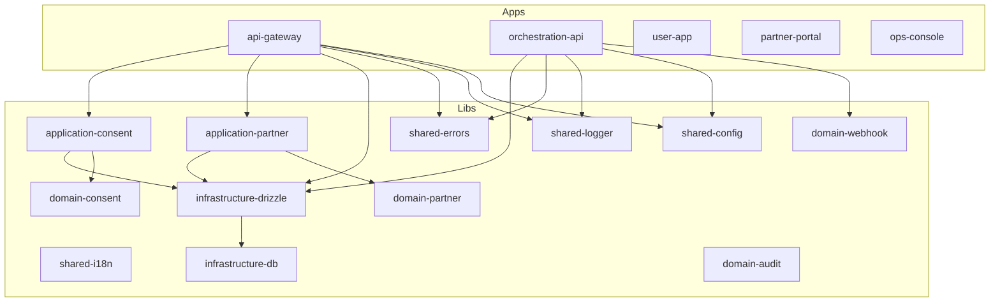

# Arquitetura

## Diagrama de alto nível

## Princípio de superfícies

| Superfície | Descrição | Plataformas |
|------------|-----------|-------------|
| **user-app** | Produto do usuário final | iOS, Android, Web |
| **partner-portal** | Portal para emissores e consumidores | Web |
| **ops-console** | Operação interna e auditoria | Web |

## Boundaries entre camadas

| Camada | Responsabilidade | Quem pode depender |
|--------|------------------|--------------------|
| **shared** | Config, logger, erros, i18n, métricas | Qualquer lib ou app |
| **domain** | Regras de negócio puras | application, interfaces |
| **application** | Use cases, orquestração | interfaces |
| **infrastructure** | DB, auth, webhooks, etc. | application |
| **interfaces** | HTTP, mobile, web, SDK | Nenhuma |

**Regra:** Libs de domínio **não** dependem de NestJS ou framework.

## Segurança de API (MVP 2.0)

O api-gateway suporta autenticação HMAC SHA-256 para parceiros:

- **PartnerSignatureGuard**: guard NestJS aplicado nas rotas `/v1/*` (exceto consents approve/reject e data-requests GET por ID, que são user-facing)
- **Feature flag**: `PARTNER_AUTH_ENABLED` (padrão: `false`) permite enforcement gradual
- **Headers**: `X-Partner-Id`, `X-Timestamp`, `X-Signature`
- **Replay protection**: nonces armazenados em `core.partner_api_nonces`
- **Usage tracking**: registrado em `core.partner_api_usage`
- **Criptografia**: secrets com AES-256-GCM; decriptação na camada de infraestrutura

## Governança de consentimento (MVP 2.1)

- **Revogação**: consentimentos aprovados podem ser revogados (`POST /v1/consents/:id/revoke`)
- **Histórico**: listagem por tenant com filtros e paginação
- **Políticas**: `consent_policies` por tenant com `max_duration_hours` e `allowed_claims`
- **Audit trail**: evento `consent_revoked` registrado

## Claims Registry (MVP 2.2)

- **Definições centralizadas**: `claim_definitions` com key única, namespace e nível de sensibilidade
- **Versionamento**: `claim_definition_versions` com JSON Schema por versão
- **Permissões por parceiro**: `partner_claim_permissions` (issue, consume, both)
- **Validação**: `ValidateClaimsAgainstRegistryUseCase` verifica existência e autorização

## Partner Dashboard (MVP 2.3)

- **Métricas agregadas**: requests, API calls, credenciais ativas, webhooks
- **Gestão de webhooks**: CRUD via `/v1/partner/webhooks`
- **Credenciais**: listagem e rotação via `/v1/partner/credentials`

## Observabilidade (MVP 2.4)

- **Métricas Prometheus**: `prom-client` com counters e histograms em `/metrics`
- **Health enriquecido**: `GET /health` com uptime, versão, status de DB
- **Readiness**: `GET /ready` verifica dependências
- **MetricsInterceptor**: tracking automático de HTTP requests
- **Logs estruturados**: correlationId, method, path, partnerId em cada request

## Wallet Readiness (MVP 2.5)

- **User subjects**: identidade portátil com `external_subject_ref`
- **Credential references**: vínculo entre subject, issuer e claim
- **Presentation sessions**: sessão de apresentação vinculada a data requests
- Base para futuras capacidades de wallet (DID, VC, selective disclosure)

## Database Schema (24 tabelas)

Todas no schema `core`:

| Grupo | Tabelas |
|-------|---------|
| Tenants & Partners | `tenants`, `partners`, `issuers`, `consumers`, `integration_credentials` |
| Requests & Consents | `data_requests`, `request_items`, `consents`, `consent_receipts` |
| Consent Governance | `consent_policies`, `consent_revocations` |
| Claims | `claim_definitions`, `claim_definition_versions`, `partner_claim_permissions` |
| Wallet | `user_subjects`, `credential_references`, `presentation_sessions` |
| Audit & Billing | `audit_events`, `billable_events` |
| Webhooks | `webhook_subscriptions`, `webhook_deliveries` |
| Security | `partner_api_nonces`, `partner_api_usage` |

## Deployment local

| Componente | Porta | URL |
|------------|-------|-----|
| api-gateway | 3333 | http://localhost:3333 |
| orchestration-api | 3334 | http://localhost:3334 |
| partner-portal | 4200 | http://localhost:4200 |
| ops-console | 4201 | http://localhost:4201 |
| user-app (web) | 8081 | http://localhost:8081 |
| PostgreSQL | 55432 | localhost:55432 |

## Princípio de privacidade

A plataforma **não** armazena como fonte principal: PII bruto (nome completo, CPF, email, etc.)

A plataforma **pode** armazenar: metadados operacionais, logs de consentimento, IDs criptográficos, trilhas de auditoria, configurações de parceiros, eventos faturáveis, status de fluxos.

## Internacionalização (i18n)

O projeto suporta múltiplos idiomas (pt-BR, en, es) com português como padrão.

- **shared-i18n** (`libs/shared/i18n`): traduções em JSON por locale e namespace
- **Frontend:** react-i18next nos apps. O user-app usa `expo-localization`
- **Backend:** nestjs-i18n nos APIs com `Accept-Language`
- **Extração de chaves:** `pnpm i18n:extract`
