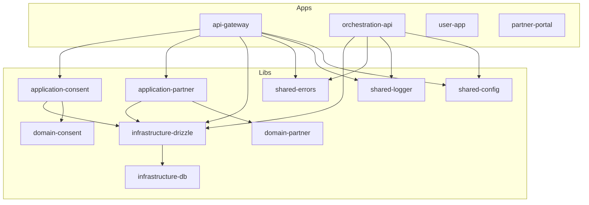

# Arquitetura

## Diagrama de alto nível

## Princípio de superfícies

| Superfície | Descrição | Plataformas |
|------------|-----------|-------------|
| **user-app** | Produto do usuário final | iOS, Android, Web |
| **partner-portal** | Portal para emissores e consumidores | Web |
| **ops-console** | Operação interna e auditoria | Web (Sprint 4+) |

## Boundaries entre camadas

| Camada | Responsabilidade | Quem pode depender |
|--------|------------------|--------------------|
| **shared** | Config, logger, erros, utilitários | Qualquer lib ou app |
| **domain** | Regras de negócio puras | application, interfaces |
| **application** | Use cases, orquestração | interfaces |
| **infrastructure** | DB, auth, webhooks, etc. | application |
| **interfaces** | HTTP, mobile, web, SDK | Nenhuma |

**Regra:** Libs de domínio **não** dependem de NestJS ou framework.

## Deployment local

| Componente | Porta | URL |
|------------|-------|-----|
| api-gateway | 3333 | http://localhost:3333 |
| orchestration-api | 3334 | http://localhost:3334 |
| partner-portal | 4200 | http://localhost:4200 |
| user-app (web) | 8081 | http://localhost:8081 |
| PostgreSQL | 5432 | localhost:5432 |

## Princípio de privacidade

A plataforma **não** armazena como fonte principal:

- PII bruto (nome completo, CPF, email, etc.)

A plataforma **pode** armazenar:

- Metadados operacionais
- Logs de consentimento
- IDs criptográficos
- Trilhas de auditoria
- Configurações de parceiros
- Eventos faturáveis
- Status de fluxos
